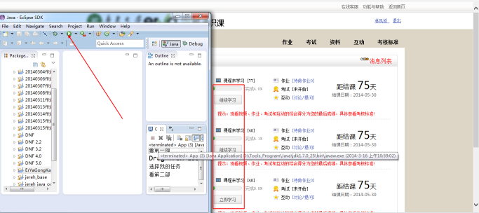
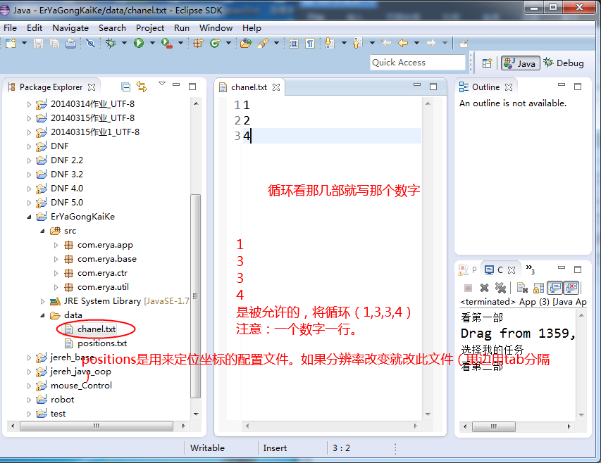
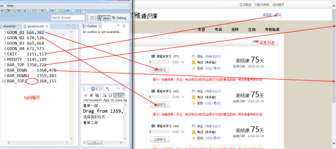
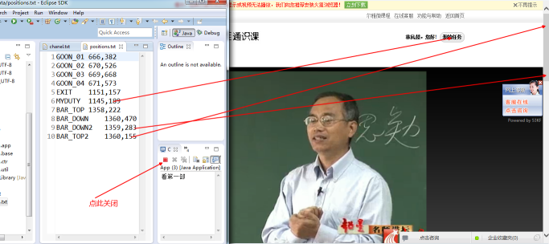

## ErYaGongKaiKe说明

## 使用简介
	本程序主要通过Java实现鼠标点击循环切换所配置的频道。
	使用中设计两个配置文件。

### data/channel.txt使用方法举例：

#### * 选修了4门课程，要4门按顺序循环播放可以配置data/channel.txt如下:
	1
	2
	3
	4
#### * 选修了4门课程，要其中1、2、4门按逆序循环播放可以配置data/channel.txt如下:
	4
	2
	1

### data/positions.txt配置分辨率和鼠标目标位置.
下边以360浏览器为例： 
1、电脑屏幕分辨率：1366*768（不要此分辨率就改positions.txt） 
2、打开浏览器(360)全屏显示(不是360，改positions.txt) 
3、初始状态调整到下面的页面 
 
4、运行程序，注意程序界面别覆盖红色框部分（可行画面：如下） 
 
5、配置方面 
 
 
最后需要了解的是： 
1、每次播放5分钟，播完自动执行下一个。 
2、全部播完后就会继续从头开始循环。 
3、要关闭就停止运行程序。 
 